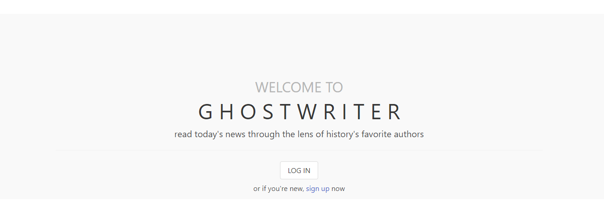
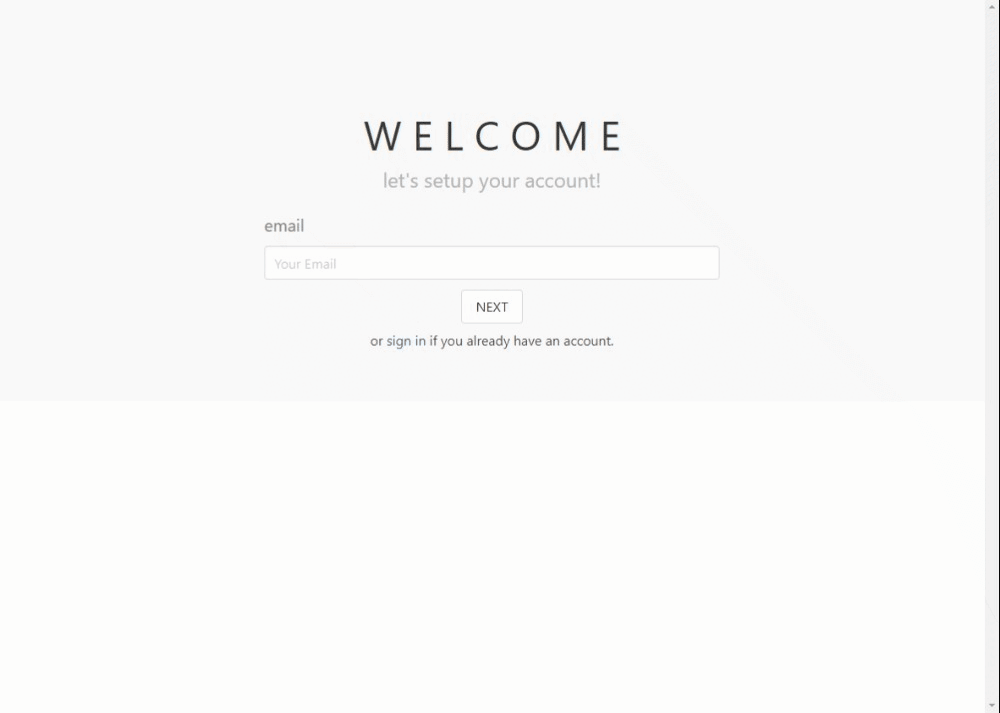

# GHOSTWRITER

## Description

Ghostwriter is a news web application with a twist. Here, you can rediscover current news through the lens of history’s favorite authors. Would you rather read about the McDonalds chicken nugget lawsuit in the boring traditional way, or would you like to gain the same information written by Dr Suess? Ghostwriter is a web application where you can login and read about modern events written by Mery Shelley, Shel Silverstein, Carl Sagan, or other literary favorites.

[Here is a link to the live webpage in Heroku](https://stormy-plains-32549-a1bc163e95b5.herokuapp.com/).

---
---

## Table of Contents

- [Usage](#usage)
- [Credits](#credits)
- [License](#license)

---
---

## Usage

### Welcome!

Welcome to Ghostwriter! Let’s get things started by either logging back in as an existing user or creating a new account. Ghostwriter is free, but you do have to have an account and be logged in to access all the articles and information.

### New User Account Creation

Let’s get started by creating a new account on Ghostwriter! It’s as simple as 1234. 1. Enter your email. 2. Pick your favorite icon to use. 3. Give us your best username. 4. Create a password and verify it!

## New User Category Preference Selection

Now let’s see what you’re most into! Pick as many or as few as you desire, or just select the category of all to have all of the categories displayed on your “for you” page!

## Returning User Login

Have you already gone through all the steps to create a new account? Then let’s just log you back in! Very straightforward and like any other login, simply provide the email and password from the account you created! All the other options you selected in the account creation page when you first created your account will still be there for you to enjoy!

## Main Page Content

We’re in! Now that you have access to the webpage, it’s time to explore! Of course you have your “for you” tab, but if you want to explore a single topic, feel free to navigate though the tabs and explore the contents! Each article includes a picture, a title, as well as a brief description in the tone of the author who “wrote” it. Click on any article to read the full post!

## Article Page

Did that description entice you to read the article? Great, me too! I may have never read the gossip article about a fight between MGK and Megan Fox, but since Willam Shakespear wrote it, I have to read more! 

## Admin Inventory Page

Here’s some fun tools for us, the Admins, that I would love to show off for you all. First here is our inventory page. It shows us what we have currently on the website and allows us to delete articles as well as change their names. Sometimes the AI rewrite doesn’t quite pan out like we’d hope, so a few adjustments or simply deleting an article can make all the difference in the end!

## Admin Generate New Articles

Here’s where the true magic happens though. As admin, we have the awesome power of creating these creative articles!
We have current news flowing in through our news api providing us with source articles. Once we’ve selected one then we get to move on to select one of our ghostwriters.
This is the moment that really makes our news website different from the rest. After we’ve selected the news article, we get to select our ghost writer. As a fun bonus to us, we had the ghostwriters’ portraits recreated to represent their work (Mery Shelly as Frankenstein’s monster is probably my favorite). Once the ghost writer has been selected, it is as simple as clicking generate and our AI does all the heavy lifting. Once completed, we get a test preview before we have the final decision on publishing the article.

Due to the nature of this project, the team had to implement a secret .env file in our own databases with sensitive information. Because of that, this code will not work if downloaded locally. Please view our live webpage on Heroku linked in the description at the top! You are more than welcome, however, to check out the sea of code files we created to make this webpage happen.

---

## Credits

Our MVP Admin / Creator team:
Javier - https://github.com/javieb5186
Daniel - https://github.com/Dmford11 , https://github.com/DanielFord11
Mark - https://github.com/markymark97
Sarah - https://github.com/Sarah-Paterson

Technologies Used:

Bulma CSS Framework - https://bulma.io/
Handlebars Templating Engine - https://handlebarsjs.com/
ExpressJS - https://expressjs.com/
Express Sessions - https://www.npmjs.com/package/express-session
NodeJS - https://nodejs.org/en
NewsAPI Library - https://newsapi.org/docs/client-libraries
OpenAI Library - https://platform.openai.com/docs/libraries
MySQL DB - https://www.mysql.com/
Squelize - https://sequelize.org/
Chat GPT - https://chat.openai.com/auth/login
News API - https://newsapi.org/

Helpful Reference Code:

The Coding Bootcamp repositories for Boot Camp Curriculum Lesson Plans: https://github.com/coding-boot-camp

Helpful Resources:

W3 School’s information about JavaScript: https://www.w3schools.com/js/default.asp
Stack Overflow’s answered questions about JavaScript: https://stackoverflow.com/
MDN’s information on JavaScript: https://developer.mozilla.org/en-US/
Google.com helping me find the above resources

The README template I used was provided by The Full-Stack Blog: https://coding-boot-camp.github.io/full-stack/github/professional-readme-guide

---

## License
MIT Licence
